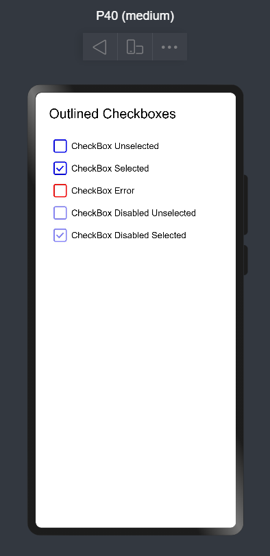
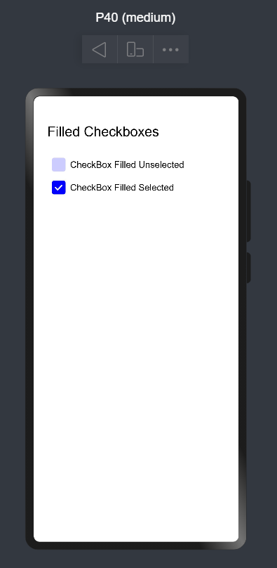
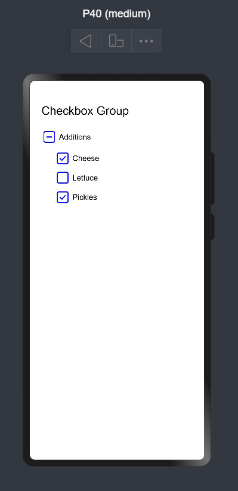

# Material_CheckBox

Material checkbox design in OpenHarmony.

## Download & Install

Install using npm

```npm i ohos-material-checkbox```

Details about OpenHarmony NPM environment configuration, see
at [here](https://gitee.com/openharmony-tpc/docs/blob/master/OpenHarmony_npm_usage.md)

## Usage Instructions

1. Import files and code dependencies

```ets
import { CheckBox, CheckBoxGroup, CheckBoxItem, CheckBoxTheme, CheckBoxStatus } from '@ohos/material-checkbox'
```

2. Initialize checkbox model data

```
private checkBoxModel: CheckBox.Model = new CheckBox.Model(1, "CheckBox Title")
```

3. Code for creating outlined checkbox

```
this.checkBoxModel.setCheckBoxTheme(CheckBoxTheme.Outlined)

CheckBox({
    model: this.checkBoxModel,
    onCheckChange: (id: number, bool: boolean) {
        console.log("onCheckChange:: " + id + " - " + bool)
    }
})
```



4. Code for creating filled checkbox

```
this.checkBoxModel.setCheckBoxTheme(CheckBoxTheme.Filled)

CheckBox({
    model: this.checkBoxModel,
    onCheckChange: (id: number, bool: boolean) {
        console.log("onCheckChange:: " + id + " - " + bool)
    }
})
```



5. Initialize checkbox group model data

```
private groupModel: CheckBox.GroupModel = new CheckBox.GroupModel()
```

6. Code for creating checkbox group

```
let items = [
    new CheckBoxItem(1, 'Cheese').setChecked(true),
    new CheckBoxItem(2, 'Lettuce').setChecked(false), 
    new CheckBoxItem(3, 'Pickles').setChecked(true)
]

this.groupModel.setTitle("Additions").setItems(items)
    
CheckBoxGroup({
    model: this.groupModel,
    onCheckResult: (status: CheckBoxStatus, selectedItems: CheckBoxItem []) {
        console.log("onCheckResult:: " + status + " - " + JSON.stringify(selectedItems))
    }
})
```



## Compatibility

Supports OpenHarmony API version 8

## Code Contribution

If you find any problems during usage, you can submit
an [Issue](https://github.com/Applib-OpenHarmony/Material_Ui_Checkbox/issues) to us. Of course, we also welcome you to
send us [PR](https://github.com/Applib-OpenHarmony/Material_Ui_Checkbox/pulls).

## Open source License

This project is based
on [Apache License 2.0](https://github.com/Applib-OpenHarmony/Material_Ui_Checkbox/blob/main/LICENSE), please enjoy and
participate in open source freely.

# Reference:

Design by : Dharma Seelan